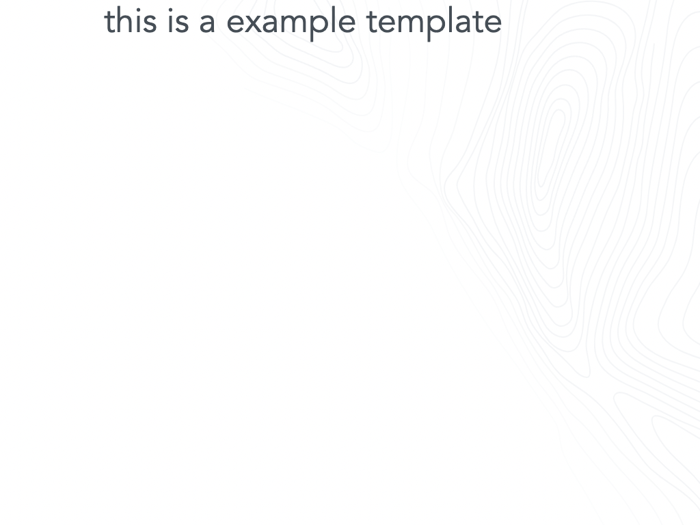

# GoodData.UI SDK - Map Example - {EXAMPLE-TITLE}

{EXAMPLE-DESCRIPTION}

You can run this example in [CodeSandbox]({CODESANDBOX-PATH}). 

[]({CODESANDBOX-PATH})

## Run example locally


1) navigate to example directory
2) ```npm install```
3) ```npm start```


## License

(C) 2017-2025 GoodData Corporation

This repository is under the GoodData commercial license available in the [LICENSE](LICENSE) file because it contains a commercial package, HighCharts.