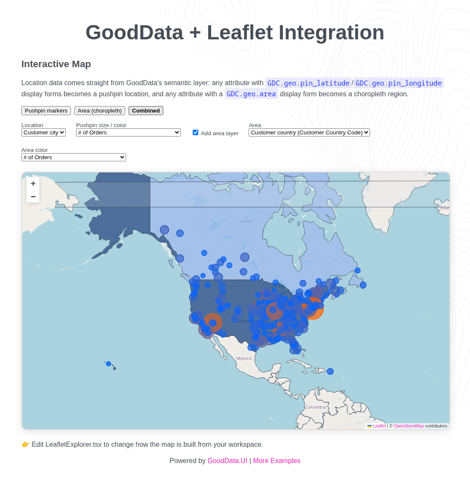

# Leaflet Map Integration

Lightweight, mobile-friendly open-source mapping library integrated with GoodData.

## Screenshot



## Key Dependencies

```json
{
  "@gooddata/sdk-ui": "^11.x",
  "@gooddata/sdk-backend-tiger": "^11.x",
  "@gooddata/sdk-model": "^11.x",
  "leaflet": "^1.9.x",
  "react-leaflet": "^5.x",
  "world-atlas": "^2.x",
  "topojson-client": "^3.x",
  "i18n-iso-countries": "^7.x",
  "react": "^19.x",
  "typescript": "^7.x"
}
```

## Features

- A switcher across the three views `@gooddata/sdk-ui-geo` offers natively (pushpin, area,
  combined), rebuilt on Leaflet's own primitives since GoodData has no Leaflet chart renderer:
  - **Pushpin markers** (`CircleMarker`) - sized/colored by a metric, or colored categorically
    via a segment attribute
  - **Area choropleth** (`GeoJSON`) - shades country-level `GDC.geo.area` regions using
    bundled `world-atlas` boundaries joined by ISO 3166-1 alpha-2 code
  - **Combined** - both layers on one map
- Every workspace attribute/metric/fact usable in the pickers is discovered dynamically from
  the catalog - nothing is hardcoded to a specific data model
- Free OpenStreetMap tiles (no API key needed)

## Run Locally

```bash
cd leaflet
npm install
npm start
```

## Documentation

- [Leaflet Documentation](https://leafletjs.com/)
- [React-Leaflet Documentation](https://react-leaflet.js.org/)

