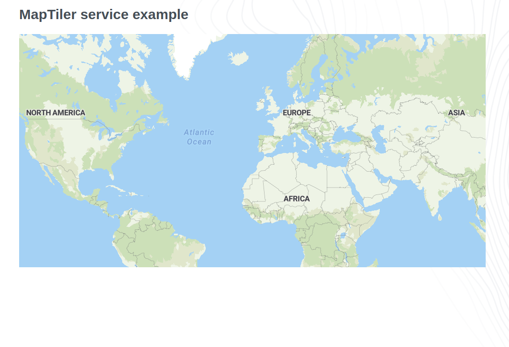

# GoodData.UI embedded in MapTiler service

- [MapTiler SDK Examples | JavaScript maps SDK | MapLibre GL JS | MapTiler](https://docs.maptiler.com/sdk-js/examples/)
- [React JS with MapTiler maps | MapTiler](https://docs.maptiler.com/react)


[]({CODESANDBOX-PATH})

## Run example locally

1) explore code in `./src/example/MapTiler.tsx`
2) ```npm install```
3) ```npm start```

## License

(C) 2017-2025 GoodData Corporation

This repository is under the GoodData commercial license available in the [LICENSE](LICENSE) file because it contains a commercial package, HighCharts.