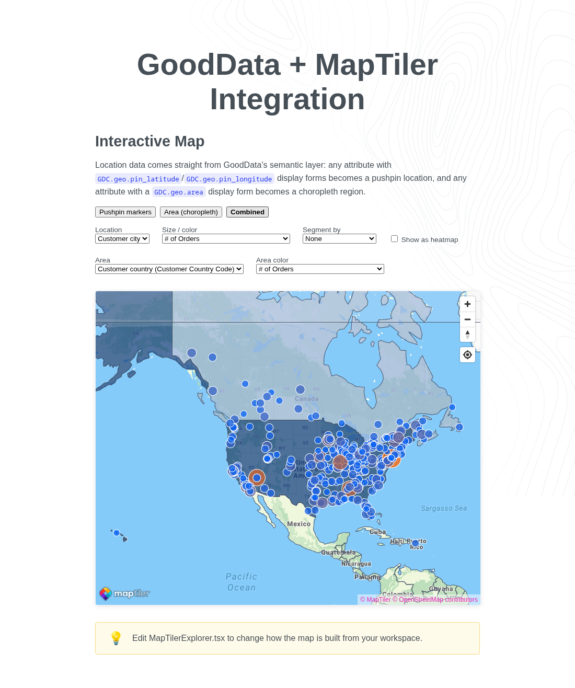

# MapTiler Map Integration

MapLibre-based service with multiple visualization modes integrated with GoodData.

## Screenshot



## Key Dependencies

```json
{
  "@gooddata/sdk-ui": "^11.x",
  "@gooddata/sdk-backend-tiger": "^11.x",
  "@gooddata/sdk-model": "^11.x",
  "@maptiler/sdk": "^4.x",
  "world-atlas": "^2.x",
  "topojson-client": "^3.x",
  "i18n-iso-countries": "^7.x",
  "react": "^19.x",
  "typescript": "^7.x"
}
```

## Features

- A switcher across the three views `@gooddata/sdk-ui-geo` offers natively (pushpin, area,
  combined), rebuilt on the MapTiler SDK's own (MapLibre-based) primitives since GoodData has no
  MapTiler chart renderer:
  - **Pushpin markers** - a data-driven `circle` layer sized/colored by a metric, colored
    categorically via a segment attribute, or swapped for MapTiler's native heatmap layer
  - **Area choropleth** - `fill`/`line` layers shading country-level `GDC.geo.area` regions
    using bundled `world-atlas` boundaries joined by ISO 3166-1 alpha-2 code
  - **Combined** - both layers on one map
- Every workspace attribute/metric/fact usable in the pickers is discovered dynamically from the
  catalog - nothing is hardcoded to a specific data model

## Setup

Requires MapTiler API key in `.env`:
```env
VITE_MAPTILER_TOKEN=your_maptiler_token
```

Get your free API key at [MapTiler Cloud](https://cloud.maptiler.com/)

## Run Locally

```bash
cd maptiler
npm install
npm start
```

## Documentation

- [MapTiler SDK Documentation](https://docs.maptiler.com/sdk-js/)
- [MapTiler Examples](https://docs.maptiler.com/sdk-js/examples/)

