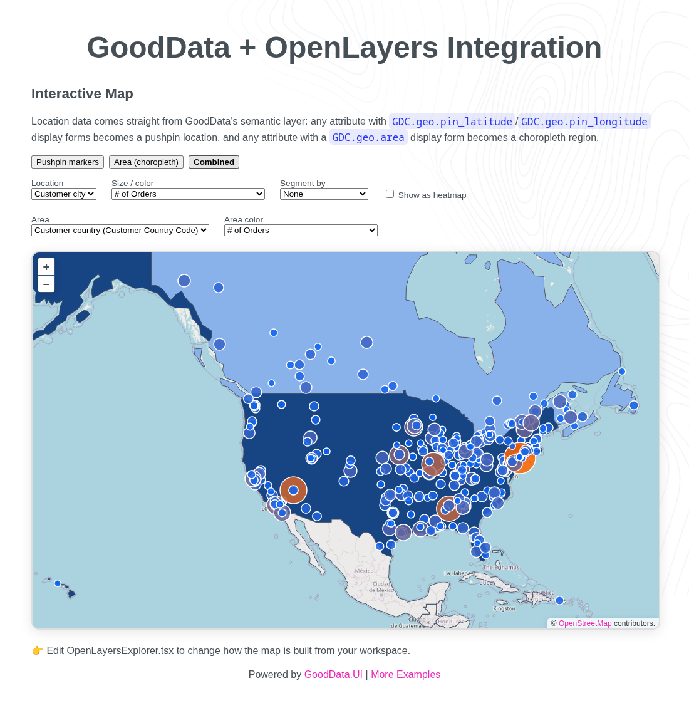

# OpenLayers Map Integration

Powerful open-source library with advanced features integrated with GoodData.

## Screenshot



## Key Dependencies

```json
{
  "@gooddata/sdk-ui": "^11.x",
  "@gooddata/sdk-backend-tiger": "^11.x",
  "@gooddata/sdk-model": "^11.x",
  "ol": "^10.x",
  "world-atlas": "^2.x",
  "topojson-client": "^3.x",
  "i18n-iso-countries": "^7.x",
  "react": "^19.x",
  "typescript": "^7.x"
}
```

## Features

- A switcher across the three views `@gooddata/sdk-ui-geo` offers natively (pushpin, area,
  combined), rebuilt on OpenLayers' own primitives since GoodData has no OpenLayers chart
  renderer:
  - **Pushpin markers** - a data-driven vector point layer sized/colored by a metric, colored
    categorically via a segment attribute, or swapped for OpenLayers' native `Heatmap` layer
  - **Area choropleth** - a vector polygon layer shading country-level `GDC.geo.area` regions
    using bundled `world-atlas` boundaries joined by ISO 3166-1 alpha-2 code
  - **Combined** - both layers on one map
- Every workspace attribute/metric/fact usable in the pickers is discovered dynamically from the
  catalog - nothing is hardcoded to a specific data model
- No API key required (uses free OpenStreetMap tiles)

## Run Locally

```bash
cd openlayers
npm install
npm start
```

## Documentation

[OpenLayers Documentation](https://openlayers.org/)

